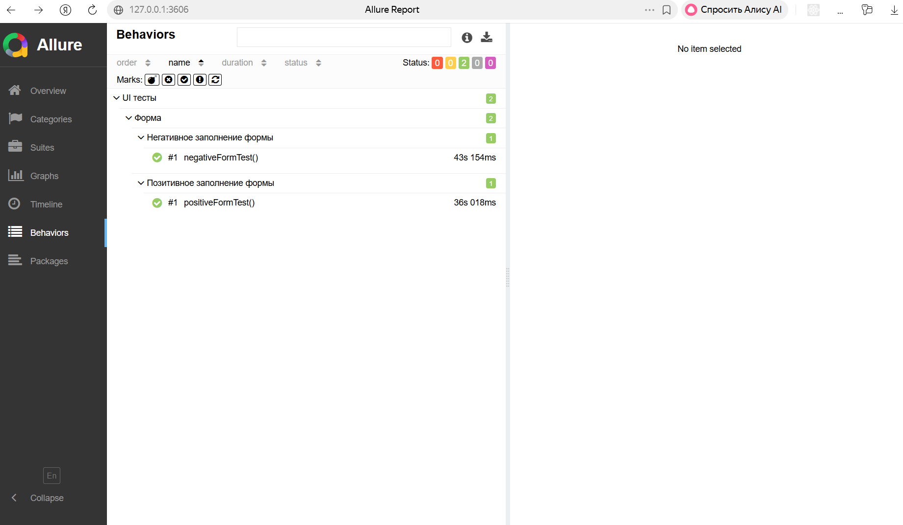

# UI Automation Tests

## Описание проекта
Проект реализует автоматизацию тестирования веб-формы на странице
[https://practice-automation.com/form-fields/](https://practice-automation.com/form-fields/) 
с использованием Java, Selenium WebDriver и JUnit 5.

Проект построен с использованием паттернов **Page Object Model**, **Page Factory** и **Fluent Interface**, 
а также формирует отчеты с помощью **Allure**.

## Технологии
- **Язык:** Java 11
- **Браузер:** Chrome
- **Фреймворк:** JUnit 5
- **Инструменты:** Selenium WebDriver, WebDriverManager
- **Сборщик:** Maven
- **Отчеты:** Allure

## Структура проекта
- `src/main/java/pages/` — Page Object классы для работы с формой
- `src/test/java/tests/` — Тестовые сценарии (позитивный и негативный)
- `target/allure-results/` — Результаты Allure
- `pom.xml` — Настройки Maven, зависимости и плагин для Allure

## Тестовые сценарии
### 1. Позитивный тест
**Описание:** Заполняем все обязательные поля формы и отправляем.

**Шаги:**
1. Открываем страницу формы
2. Заполняем поле `Name`
3. Заполняем поле `Password`
4. Выбираем напитки `Milk` и `Coffee`
5. Выбираем цвет `Yellow`
6. В поле `Do you like automation?` выбираем `Yes`
7. Заполняем Email строкой `name@example.com`
8. В поле `Message` вводим количество инструментов и инструмент с наибольшим количеством символов
9. Нажимаем `Submit`
10. Проверяем появление алерта с текстом `Message received!`

**Ожидаемый результат:** Алерт появляется и содержит текст `Message received!`.

### 2. Негативный тест
**Описание:** Не заполняем поля.

**Шаги:**
1. Открываем страницу формы
2. Оставляем все поля пустыми
3. Нажимаем `Submit`
4. Проверяем, что **алерт не появляется**

**Ожидаемый результат:** Форма не отправляется, алерт не появляется.

## Запуск тестов
1. Собрать проект и выполнить тесты Maven:

```bash
mvn clean test
```
2. Сформировать отчет Allure
```bash
allure serve target/allure-results
```

## Отчёт о пройденных тестах через Allure
